## Задача 1

1. Возьмите из демонстрации к лекции готовый код для создания с помощью двух вызовов remote-модуля -> двух ВМ, относящихся к разным проектам(marketing и analytics) используйте labels для обозначения принадлежности.

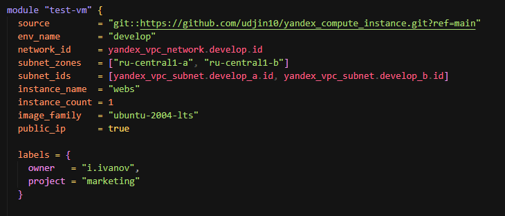
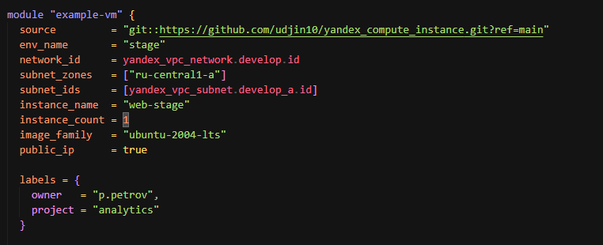

В файле [cloud-init.yml](./src/cloud-init.yml) необходимо использовать переменную для ssh-ключа вместо хардкода. Передайте ssh-ключ в функцию template_file в блоке vars ={} . 

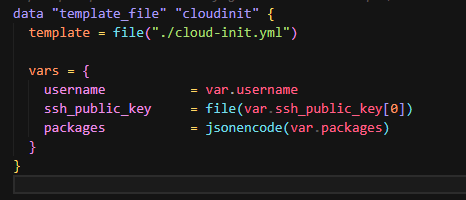

2. Добавьте в файл [cloud-init.yml](./src/cloud-init.yml) установку nginx.

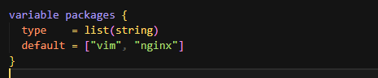

3. Предоставьте скриншот подключения к консоли и вывод команды sudo nginx -t

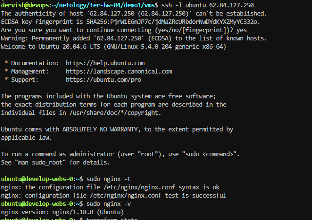

скриншот консоли ВМ yandex cloud с их метками.

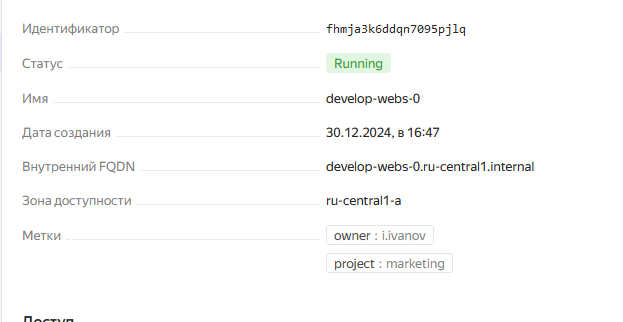
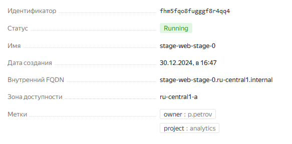

 Откройте terraform console и предоставьте скриншот содержимого модуля.

 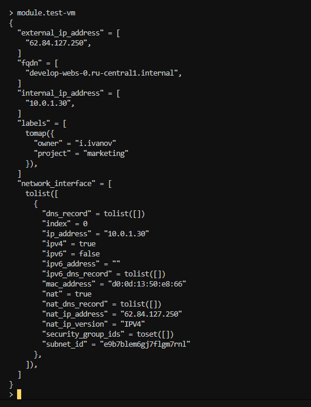

## Задача 2

1. Напишите локальный модуль [vpc](./src/vpc/main.tf), который будет создавать 2 ресурса: одну сеть и одну подсеть в зоне, объявленной при вызове модуля, например: ru-central1-a.

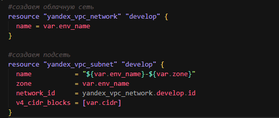

2. Вы должны передать в модуль [переменные](./src/vpc/variables.tf) с названием сети, zone и v4_cidr_blocks.

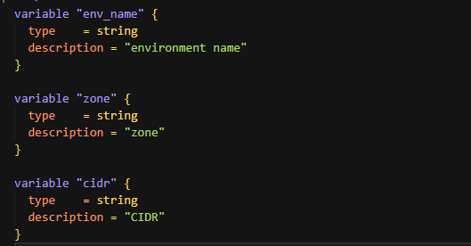

3. Модуль должен возвращать в root module с помощью [output](./src/vpc/output.tf) информацию о yandex_vpc_subnet. Пришлите скриншот информации из terraform console о своем модуле.

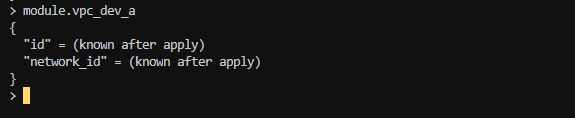

4. Замените ресурсы yandex_vpc_network и yandex_vpc_subnet созданным модулем. Не забудьте передать необходимые параметры сети из модуля vpc в модуль с виртуальной машиной.

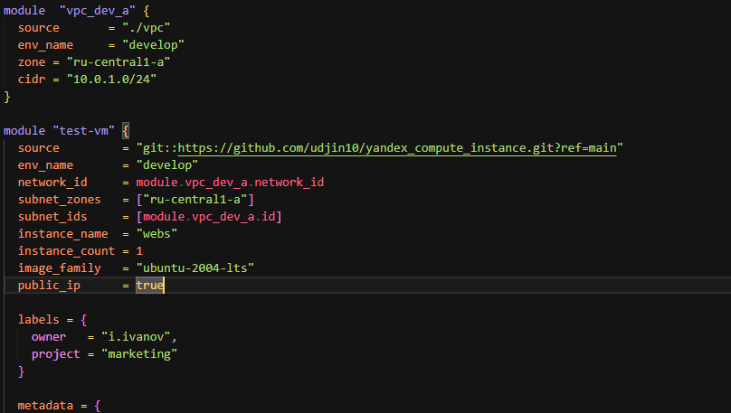
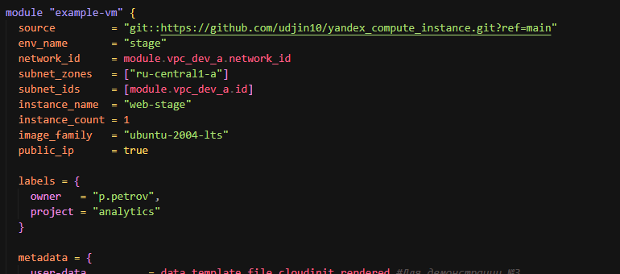

5. Сгенерируйте документацию к модулю с помощью terraform-docs.

## Requirements

| Name | Version |
|------|---------|
|  [terraform](#requirement\_terraform) | >=1.8.4 |

## Providers

| Name | Version |
|------|---------|
|  [yandex](#provider\_yandex) | n/a |

## Modules

No modules.

## Resources

| Name | Type |
|------|------|
| [yandex_vpc_network.develop](https://registry.terraform.io/providers/yandex-cloud/yandex/latest/docs/resources/vpc_network) | resource |
| [yandex_vpc_subnet.develop](https://registry.terraform.io/providers/yandex-cloud/yandex/latest/docs/resources/vpc_subnet) | resource |

## Inputs

| Name | Description | Type | Default | Required |
|------|-------------|------|---------|:--------:|
|  [cidr](#input\_cidr) | CIDR | `string` | n/a | yes |
|  [env\_name](#input\_env\_name) | environment name | `string` | n/a | yes |
|  [zone](#input\_zone) | zone | `string` | n/a | yes |

## Outputs

| Name | Description |
|------|-------------|
|  [id](#output\_id) | n/a |
|  [network\_id](#output\_network\_id) | n/a |

## Задача 3