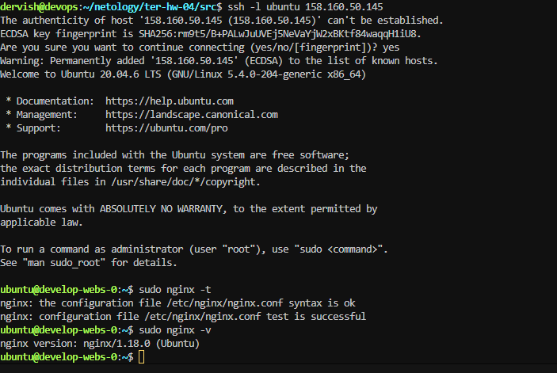
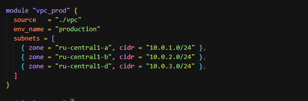
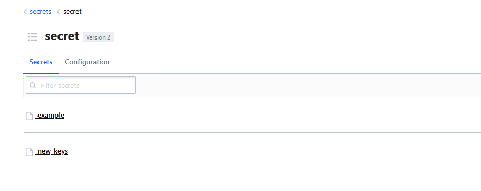

## Задача 1

1. Возьмите из демонстрации к лекции готовый код для создания с помощью двух вызовов remote-модуля -> двух ВМ, относящихся к разным проектам(marketing и analytics) используйте labels для обозначения принадлежности.

В файле [cloud-init.yml](./src/cloud-init.yml) необходимо использовать переменную для ssh-ключа вместо хардкода. Передайте ssh-ключ в функцию template_file в блоке vars ={} . 

2. Добавьте в файл [cloud-init.yml](./src/cloud-init.yml) установку nginx.

3. Предоставьте скриншот подключения к консоли и вывод команды sudo nginx -t

скриншот консоли ВМ yandex cloud с их метками.

 Откройте terraform console и предоставьте скриншот содержимого модуля.

 

## Задача 2

1. Напишите локальный модуль [vpc](./src/vpc/main.tf), который будет создавать 2 ресурса: одну сеть и одну подсеть в зоне, объявленной при вызове модуля, например: ru-central1-a.

2. Вы должны передать в модуль [переменные](./src/vpc/variables.tf) с названием сети, zone и v4_cidr_blocks.

3. Модуль должен возвращать в root module с помощью [output](./src/vpc/output.tf) информацию о yandex_vpc_subnet. Пришлите скриншот информации из terraform console о своем модуле.

4. Замените ресурсы yandex_vpc_network и yandex_vpc_subnet созданным модулем. Не забудьте передать необходимые параметры сети из модуля vpc в модуль с виртуальной машиной.

5. Сгенерируйте документацию к модулю с помощью terraform-docs.

>Ответ: [документацию](./src/vpc/README.md) получил с помощью команды `docker run --rm --volume "$(pwd):/terraform-docs" -u $(id -u) quay.io/terraform-docs/terraform-docs:0.19.0 markdown /terraform-docs > README.md`

## Задача 3

1. Выведите список ресурсов в стейте.

2. Полностью удалите из стейта модуль vpc.

3. Полностью удалите из стейта модуль vm.

4. Импортируйте всё обратно. Проверьте terraform plan. Значимых(!!) изменений быть не должно. Приложите список выполненных команд и скриншоты процессов.

## Задача 4*

1. Измените модуль [vpc](./src/vpc/main.tf) так, чтобы он мог создать подсети во всех зонах доступности, переданных в переменной типа list(object) при вызове модуля.

## Задача 5*

1. Напишите модуль для создания кластера managed БД Mysql в Yandex Cloud с одним или несколькими(2 по умолчанию) хостами в зависимости от переменной HA=true или HA=false. Используйте ресурс yandex_mdb_mysql_cluster: передайте имя кластера и id сети.

>Ответ: модуль [mysql_cluster](./task5/mysql_cluster/)

2. Напишите модуль для создания базы данных и пользователя в уже существующем кластере managed БД Mysql. Используйте ресурсы yandex_mdb_mysql_database и yandex_mdb_mysql_user: передайте имя базы данных, имя пользователя и id кластера при вызове модуля.

>Ответ: модуль [mysql_db](./task5/mysql_db/)

3. Используя оба модуля, создайте кластер example из одного хоста, а затем добавьте в него БД test и пользователя app. Затем измените переменную и превратите сингл хост в кластер из 2-х серверов.

>Ответ: [main.tf](./task5/main.tf)

4. Предоставьте план выполнения и по возможности результат. Сразу же удаляйте созданные ресурсы, так как кластер может стоить очень дорого. Используйте минимальную конфигурацию.

## Задача 6*

1. Используя готовый yandex cloud terraform module и пример его вызова(examples/simple-bucket): https://github.com/terraform-yc-modules/terraform-yc-s3 . Создайте и не удаляйте для себя s3 бакет размером 1 ГБ(это бесплатно), он пригодится вам в ДЗ к 5 лекции.

>Ответ: [решение](./task6/)

## Задача 7*

1. Разверните у себя локально vault, используя [docker-compose.yml](./task7/docker-compose.yml) в проекте.

2. Для входа в web-интерфейс и авторизации terraform в vault используйте токен "education".

3. Создайте новый секрет по пути http://127.0.0.1:8200/ui/vault/secrets/secret/create Path: example secret data key: test secret data value: congrats!

4. Считайте этот секрет с помощью terraform и выведите его в output.

>Ответ [main.tf](./task7/main.tf)

5. Попробуйте самостоятельно разобраться в документации и записать новый секрет в vault с помощью terraform.

>Ответ [main.tf](./task7/main.tf)

